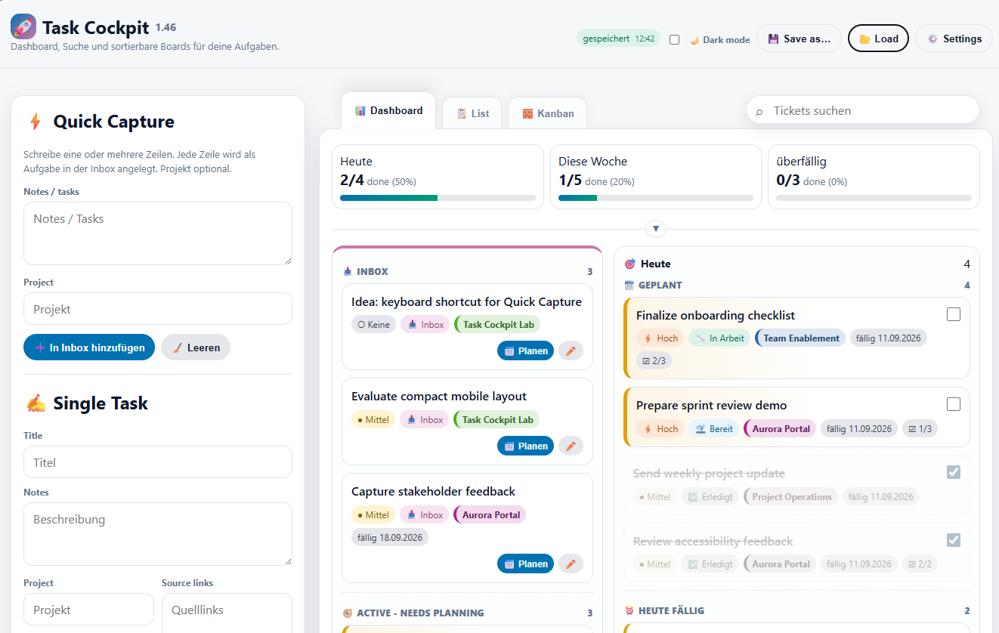
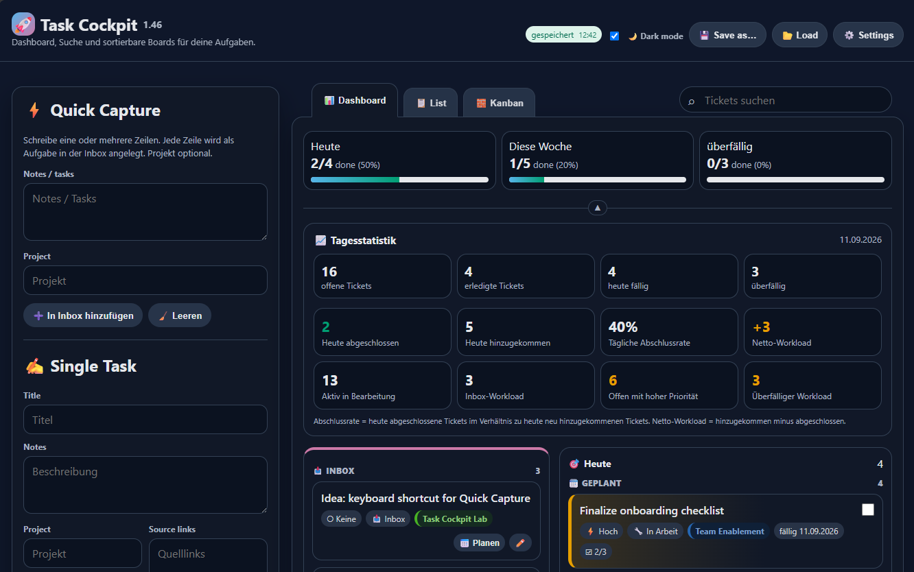
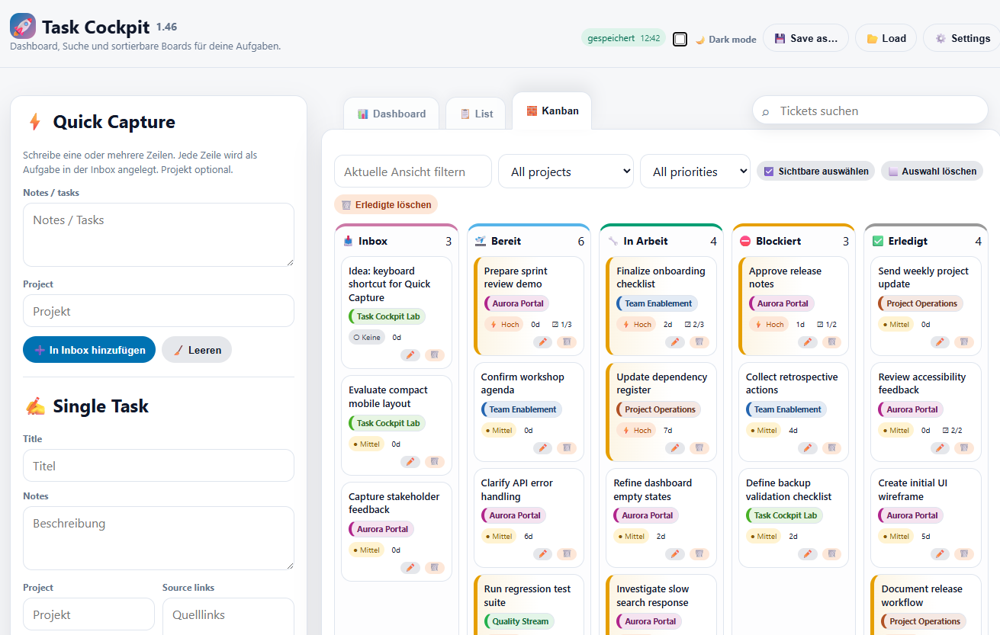
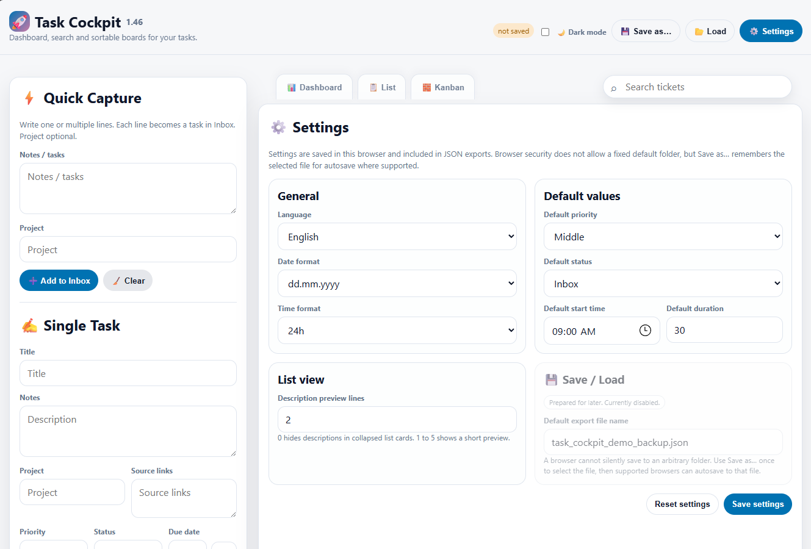

# Task Cockpit

Task Cockpit is a portable, single-file task dashboard that runs directly in a modern browser without installation or administrator rights.

## Preview

Task Cockpit combines daily planning, workload statistics, Kanban organization, and configurable task workflows in a portable browser application.

### Dashboard

  

### Daily statistics and dark mode

  

<strong>Show more screenshots</strong>

### Kanban board

  

### Settings

  

## Current status

- Stable reference: `1.46`
- Development line: `2.0.0-alpha.1`
- Current app: [`app/index.html`](app/index.html)

## Highlights

- Quick Capture and detailed task creation
- Dashboard, List, and Kanban views
- Inbox, Today, This Week, Overdue, Blocked, and Done workflows
- Drag-and-drop planning and ordering
- Projects, priorities, subtasks, links, and screenshots
- Local browser storage and JSON backup/restore
- Expandable daily statistics
- iCalendar export
- Experimental prefilled Outlook Web events
- Dark mode and configurable date/time display

## Run locally

Download or clone the repository and open `app/index.html` in a current browser. No build step is required.

## Data and privacy

Task data stays in browser storage unless the user explicitly exports a JSON backup or opens an Outlook event. Never commit personal JSON backups, private links, screenshots containing confidential information, tokens, or company data.

## Version history

The repository history was reconstructed from the original sequential HTML snapshots supplied by the project author. Each commit contains the actual file state of that version. Commit timestamps represent the repository reconstruction, not the original implementation dates. See [`docs/HISTORY-METHODOLOGY.md`](docs/HISTORY-METHODOLOGY.md).

## License

Task Cockpit is licensed under the [MIT License](LICENSE).
